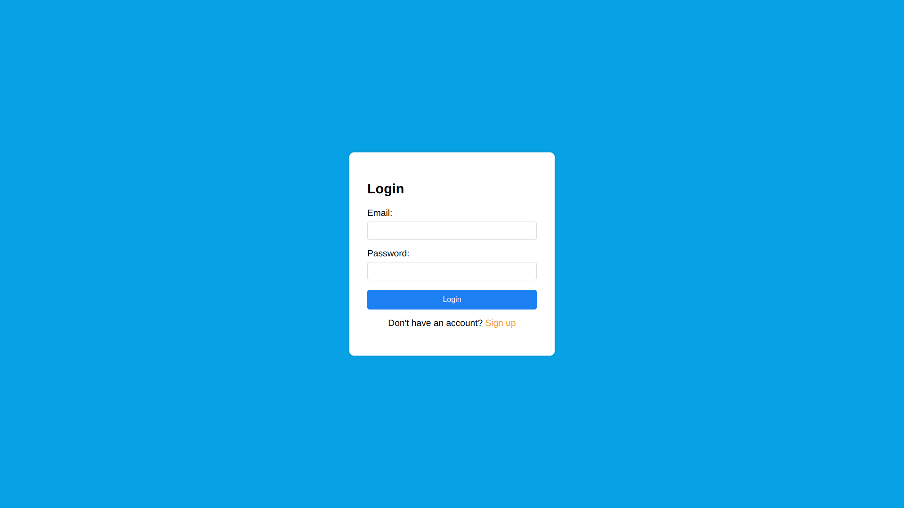
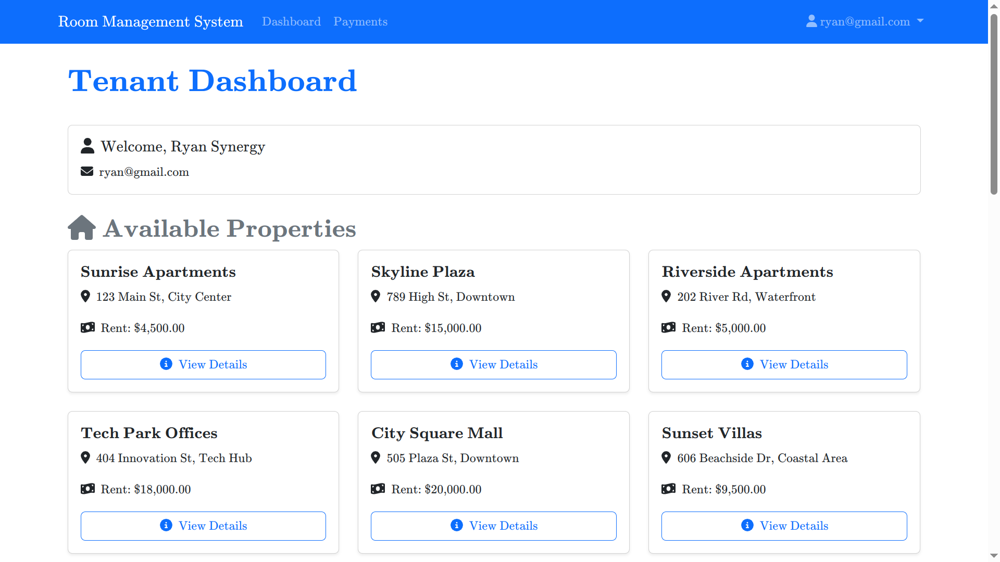
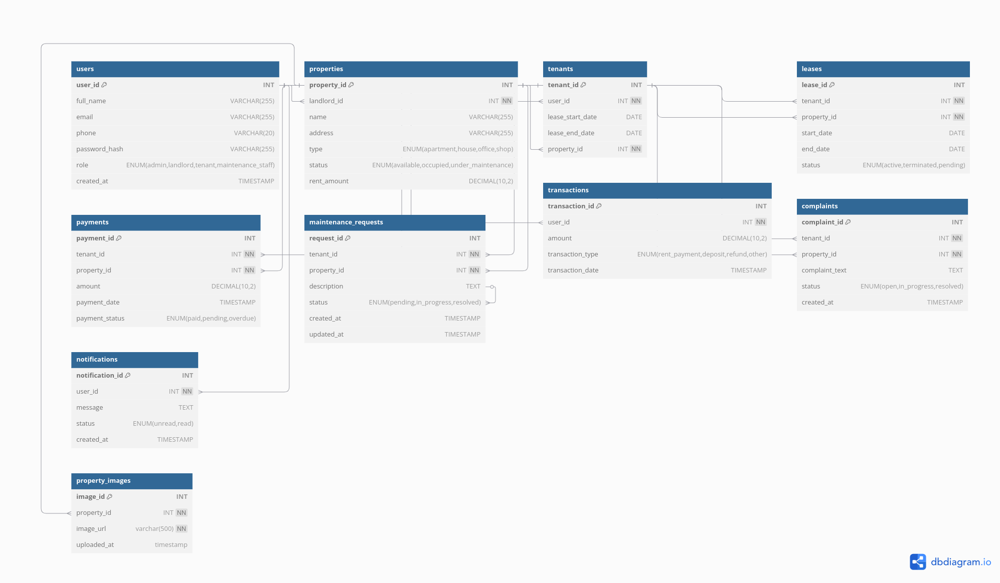

# 🏠 Rentals Management System

## 📌 Overview
The **Rentals Management System** is a web-based application designed to streamline the management of rental properties. It provides an interface for both landlords and tenants, enabling efficient property management, rent payments, maintenance tracking, and tenant communication.

## 🚀 Features
### 👨‍💼 For Admin/Landlord
- 🏢 Add, update, and delete rental properties
- 👥 Manage tenant details
- 💰 Track rental payments
- 📊 Generate reports on rental income and outstanding balances
- 🛠️ Manage maintenance requests
- 🔔 Send notifications to tenants

### 🏠 For Tenants
- 🏡 View available properties
- 🛠️ Submit and track maintenance requests
- 📄 View lease details
- 💳 Pay rent online
- 📞 Contact the landlord or management

## 🛠 Technologies Used
- **Backend:** 🐘 PHP (with MySQL for database)
- **Frontend:** 🌐 HTML, 🎨 CSS, ⚡ JavaScript
- **Database:** 🗄️ MySQL
- **Web Server:** 🖥️ Apache (XAMPP or similar)

## 📥 Installation Instructions
### 🔧 Prerequisites
Ensure you have the following installed on your system:
- 🛠️ XAMPP (or any local web server with PHP & MySQL)
- 🌍 A web browser

### 📌 Steps to Install
1. 📂 Clone the repository or download the project files:
   ```sh
   git clone https://github.com/yourusername/rentals-management-system.git
   ```
2. 📂 Move the project folder to your web server directory (`htdocs` for XAMPP).
3. 🏗️ Create a MySQL database and import the `database.sql` file provided in the project.
4. 📝 Update the database connection details in `config.php`:
   ```php
   $host = "localhost";
   $username = "root";
   $password = "";
   $database = "rental_management";
   ```
5. ▶️ Start Apache and XAMPP.
    ▶️ Start your MySQL server (change port if neccessary default = 3306)
6. 🌐 Open your browser and navigate to:
   ```sh
   http://localhost/project/
   ```

## 📸 Screenshots
### 🔑 Login Page


### 🏠 Dashboard


### 📊 Database Schema


## 📖 Usage Guide
### 🔑 Admin Panel
1. 🔓 Log in as an admin.
2. 🏠 Add new properties and manage existing ones.
3. 👥 View and manage tenant details.
4. 💰 Check rent payments and generate reports.
5. 🛠️ Approve or reject maintenance requests.

### 🏠 Tenant Dashboard
1. 🔓 Log in as a tenant.
2. 📄 View your lease details.
3. 💳 Pay rent online through the system.
4. 🛠️ Submit maintenance requests and track their status.
5. 📞 Contact the landlord through the messaging system.

## 🚀 Future Enhancements
- 🔐 Implement role-based access control
- 📩 Enable SMS/email notifications for rent reminders
- 💳 Integrate more payment gateways
- 📊 Add analytics for rental trends

## 🤝 Contributing
Contributions are welcome! To contribute:
1. 🍴 Fork the repository.
2. 🌱 Create a new branch (`feature-branch`).
3. 📝 Commit your changes.
4. 📤 Push to the branch and submit a pull request.

## 📜 License
This project is licensed under the MIT License.

## 📞 Contact
For inquiries or support, please contact:
- 📧 **Email:** predatormj.v3@gmail.com
- 🖥 **GitHub:** [Joseph-tech-dev](https://github.com/Joseph-tech-dev)

